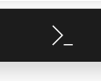

# Sign reader sample

This project is designed to be a sample Azure project using [Computer Vision](https://azure.microsoft.com/services/cognitive-services/computer-vision/). You can use this to see how Computer Vision works, or as a starter for a project you're creating.

## Requirements

### Python

In order to run the site you will need [Python](https://python.org) installed locally. You can install Python by visiting the [Python downloads](https://www.python.org/downloads/) page.

### Azure Cognitive Services

To use Computer Vision you will need a key for Azure Cognitive Services. We will create this by using `az hack create` in Azure Cloud Shell.

1. Navigate to the [Azure Portal](https://portal.azure.com) and authenticate with your account.

2. Click the Cloud Shell icon towards the upper right


3. After the shell opens in the browser, issue the following command to install the [`az hack` extension](https://github.com/microsoft/hackwithazure/blob/master/az-hack.md).

``` console
az extension add -n hack
```

4. Issue the following command to create an [App Service](https://azure.microsoft.com/services/app-service/) to host your website, an instance of MySQL for data, and a key for [Cognitive Services](https://azure.microsoft.com/services/cognitive-services/).

``` console
az hack create -n signdemo -r python -d mysql -l westus2 --ai
```

> **NOTE**: The command will add a random set of characters to the name you provide (**signdemo** in our example). This ensures the name will always be unique.

5. Make a note of the **COGSVCS_CLIENTURL** and **COGSVCS_KEY** values; you'll be using those in just a few moments.

## Local setup

1. Open a command or terminal window. Clone the sample repository.

``` console
git clone https://github.com/geektrainer/sign-reader
```

2. Navigate to the folder using a terminal or command window.

``` console
cd sign-reader
```

3. Create a virtual environment using Python and install the libraries listed in [requirements.txt](./requirements.txt)

``` console
# Windows
python -m venv env
.\env\Scripts\activate
pip install -r requirements.txt

# macOS or Linux
python3 -m venv env
. ./env/bin/activate
pip3 install -r requirements.txt
```

4. Open the folder in the code editor of your choice. If you are using [Visual Studio Code](https://code.visualstudio.com/) you can use the command below.

``` console
code .
```

5. Add a new file named **.env**, which is used by [dotenv](https://github.com/theskumar/python-dotenv), which simulates environment variables. Add the text below, and then update the placeholders with the values you created in the earlier step.

> **NOTE**: The leading **.** is required on the file name.

``` text
COGSVCS_CLIENTURL=<your url>
COGSVCS_KEY=<your key>
```

6. Run your application!!! Return to the terminal or command window you had previously, and run the application in flask.

``` console
flask run
```

7. Navigate to **http://localhost:5000**. Click **Upload**, and choose an image (such as the sample.jpg in this repository) which has text. The image and text will be displayed!

## Deploy your project

Ready to take show your project to the world? If so, the `az hack create` utility you used previously will help you out. If you return to the portal shell, you'll notice steps to perform a Git deploy are listed there.
